# Anomaly Detection from Mobile Data

This project will show how to collect live accelerometer and gyroscope data from a mobile device and pass it to Event Stream Processing (ESP) using an MQTT protocol.
Once in ESP the JSON data is decoded and passed to the unsupervised machine learning models k-means and subspace tracking (SST).
These unsupervised machine learning models are able to find patterns in data and are trained dynamically from streaming data.

### Prerequisites

List of required software and hardware:
    
   * [SAS Event Stream Processing](https://www.sas.com/en_us/software/event-stream-processing.html)
   * Android powered mobile device which contains an accelerometer and gyroscope
   
## Table of Contents

* Overview
* Use Case
* Architecture
* Mobile Application
* Installation
* Configuration
* ESP Project
    * Function
    * Copy
    * Aggregate
    * K-means Training
    * K-means Scoring
    * SST Calculate
    * Join
*  Anomaly Detection Example
* Summary

   
## Overview

This repository will show you how easy it is to use the MQTT protocol to send JSON formatted data to ESP for further analysis.
The mobile platform provides a level of personal interaction with the data source that cannot be easily replicated using canned data sources.
The following diagram outlines the overall solution flow:

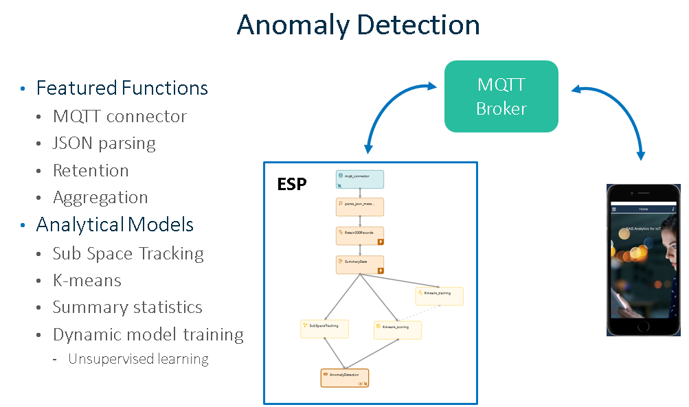

Phone sensor data is transported to ESP, combined and enhanced to produce an anomaly detection system which will send data back to the mobile device for alerting purposes.

   
## Use Case

In this use case we will consider the mobile device a sensor that can be placed on any stationary piece of equipment on a factory floor.
For demo purposes our anomaly detection time frame will be 30 seconds.  In a real world scenario, this time frame will be much longer.
That is to say as long as the equipment continues to generate 30 seconds of consistent readings, this will be considered the baseline.
Once that 30 second baseline is established new observations will be compared against it and any deviation will be considered an anomaly.
KPIs will determine the severity of the anomaly. 
This type of self-training is awesome because the baseline is dynamically set and does not have to be calculated separately for each piece of equipment. 
If the sensor is placed on a rotating object, the accelerometer data being produced becomes the norm as long as it is consistent.
Imagine a factory floor with 1000 machines each oscillating at different amounts.
Now imagine how much time would be saved if the sensors placed on these machines were able to self-train their own unique anomaly detection models.
Very powerful. 

##  Architecture

Because MQTT is one of the more popular IoT protocols we are going to use it along with the message format JSON to communicate both inbound and outbound between the mobile device and ESP. 
Consider the following diagram:

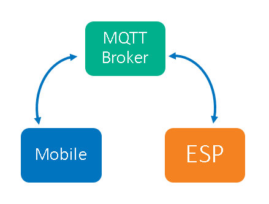

You may use your own MQTT broker or a freely available one.  As long as ESP and the mobile device can reach the broker communication is established.
This architecture allows for the data source to be abstracted to where the mobile device data can come in a variety of ways without needing to modify the ESP model.

##  Mobile Application

The mobile application collects data from various phone sensors such as accelerometer, gyroscope and location. 
The sensor data is by default collected at 10 events per second and formatted into a JSON string and then sent to the MQTT broker defined and active.
The application is built using [Solar2D](https://solar2d.com/) which is a Lua based SDK which is a cross-platform framework ideal for 
rapidly creating apps and games for mobile devices, TV, desktop systems and HTML5. 
That means you can create your project once and publish it to multiple types of devices, including Apple iPhone and iPad, Android phones and tablets, 
Amazon Fire, Mac Desktop, Windows Desktop, Linux, HTML5 and even connected TVs such as Apple TV, Fire TV, and Android TV.

###  Installation 

The application is currently not in an app store.  However, you can find the Android apk file [here](./programs/IoT-Demo-Sensor.apk).
This apk file can easily be side loaded onto any Android device.
Please Google how to side load an application using your device type and operating system for details.
For Apple phones you will have to become an Apple developer which costs 99 dollars per year.
It is cheaper and easier just to go buy an 80 dollar Kindle Fire and use that.  Then you will also be able to read books on the beach as well!

###  Configuration

Configuration is a twostep process.  First configure your broker settings to match your ESP project.  Second, select Anomaly Detection from the navigation panel.

Here is an example of the broker list.  You can see from the green bar that the application is actively connected to the sample MQTT broker.
You may define as many brokers as you need.  However, remember that the broker name must match the ESP project MQTT connector definition.

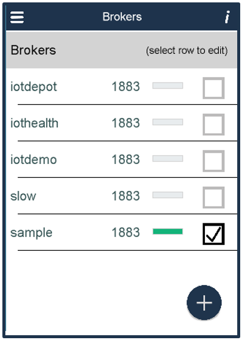

Here is an example of the sample broker definition.  The broker test.mosquitto.org should always be active.
The mobile application will publish to the topic PhoneSensors and subscribe to the topic Outcomes.
These topic names may be changed. However, the corresponding ESP project will also need to be updated to match the new names.

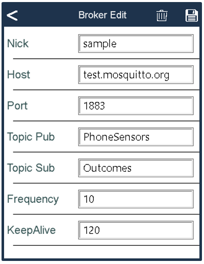

Once you have confirmed that the broker is correctly configured and active select Anomaly Detection from the navigation panel to view the results.
If the ESP project is running, your "Anomaly Detection" panel will start updating in 30 seconds.

##  ESP Project

Now let's take a look at the ESP project that will consume the phone sensor data. 

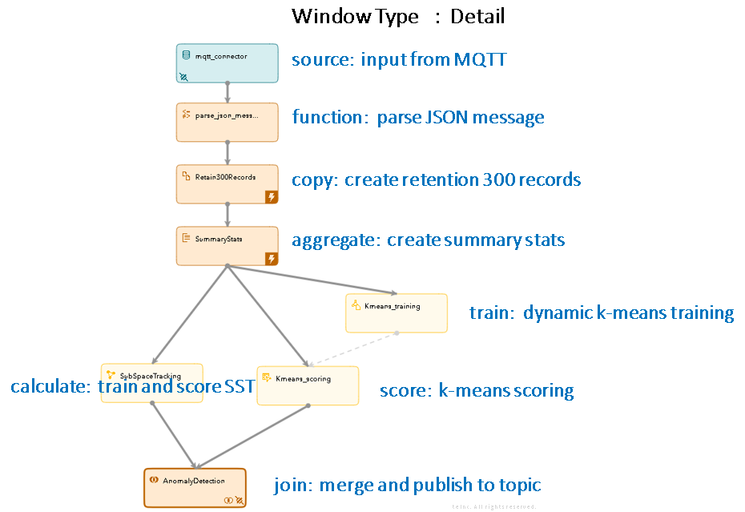

### Source

Data flows from the top of the diagram starting with the blue source window.
The small icon in the lower left of the source window indicates that this source window contains an input connector.
If we take a closer look at the connector configuration we can see the host, and inbound topic name. 
These items must match the settings in the mobile application broker settings.
The mqttmsgtype indicates all the JSON data will be placed in one opaqestring.
The next step will parse the JSON data in the string and place it into various ESP variables.

### Function

The next window is called a function window and will parse the input message into ESP variables.
The first step happens in the functions properties section.  This is where the opaqestring called $message is loaded into a field called jsonData.
The JSON data is then parsed in the functions section into variables.  These variables are part of the output schema for the next step in the process.
Here is an example of the parsing syntax:  

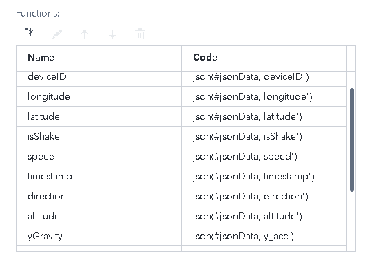

In this example the Name column  contains a value that matches the output schema for this function window.
This is the parsed JSON value that will be passed to the next downstream window.
The Code column  contains any function you would like to run.
A complete list of available functions can be found in the [Event Stream Manager documentation.](https://go.documentation.sas.com/?cdcId=espcdc&cdcVersion=6.2&docsetId=espcreatewindows&docsetTarget=p1b9sd4ykolfkwn1orjfocca3xs3.htm&locale=en)
Here we are using the "json" function to parse the variable "#jsonData" for various strings.
You may note that the JSON string may contain more data than our flow requires.  This parsing method provides a method for ignoring superfluous data.
You may also notice that variable names may be remapped to more meaningful names.
Here I am remapping the JSON variable y_acc to an ESP variable called yGravity.

### Copy

In order to do in memory calculations on data we must create retention.
Retention is loading a set number of records either by time or count into memory so that they can be used for aggregation and dynamic modeling.
We do this in a copy window.  Here we are specifying 300 records be saved in memory.
Since the mobile application is sending in 10 records per second.  300 records equals 30 seconds worth of data. 
Note that the lightning bolt in the lower right of the window indicates that this window maintains state or retention.

### Aggregate

The next window is an Aggregate window.  Since we now have 300 records in memory we can start to use that data to create summary statistics.
Using the aggregation window we will create 6 new variables.
We will create a standard deviation and average for the X,Y and Z Gravity data sent in by the phone's accelerometer.
These values are updated each time a new message is received on our MQTT topic.  Only the newest 300 records are used in our calculations .

### K-means Training

The train window receives all the phone sensor data and uses it to dynamically  create a model based on the analytical model specified, in this case, K-means.
Other types of models are available such as:

  * Linear Regression
  * SVM (Support Vector Machine)
  * Logistic Regression
  * Recommender
  * TSNE (T-distributed Stochastic Neighbor Embedding)
  
K-means is a clustering method which aims to partition observations into groups.
For example, imagine shooting 100 arrows into a target.  Your arrows will form clusters or groups on the target.
Each group will have a geographical center point. 
If you shoot one more arrow, represented here as the green dot, you can then measure the distance from the center point to the location of the new arrow.
This distance is a measure of the deviation from the baseline or norm.
In the diagram the red circle represents the mathematically defined cluster based on the dispersion of data in the scatter plot.
Here the red arrow represents the distance from the center of the circle to the new data.
This of course is a simplified view.  Keep in mind that our accelerometer data is 3 dimensional and contains  data points for the X, Y and Z values. 

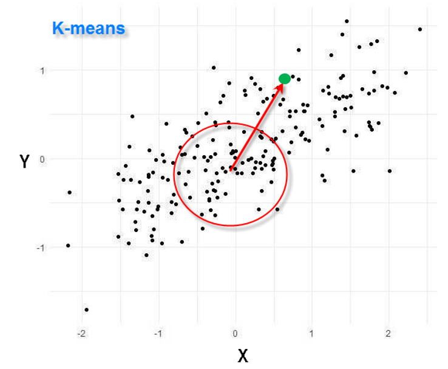

The training window will use this algorithm to create a model and then pass that model to the scoring window to calculate the distances from the norm.

### K-means Scoring

The dynamically trained model is passed to the scoring window from the training window and used to score each new event.
In our phone sensor example, we might place the phone on a flat surface and leave it there for 30 seconds.
Since the phone is not moving all the accelerometer readings will be nearly zero.
Zero becomes the center point of our k-means cluster.  As long as the phone does not move the distance from the norm is also zero.
If I start shaking the phone the new events will deviate from the baseline greatly and the distance value will increase.
K-means only works as an anomaly detector because our use case produces very consistent values.  Next let's look at the more robust algorithm subspace tracking.

### SST Calculate

Calculate windows are designed for data normalization and transformation methods, as well as for learning models that bundle training and scoring together.
Here we are going to use a subspace tracking algorithm  also known as moving window PCA (principal component analysis) to determine deviations from the norm.
The k-means algorithm attempts to group data points into clusters and measure the distance from the center of the cluster.
Principal component analysis reduces the dimensionality of the data from n variables to m principal components.
Since we are bringing down the dimension of the original data we are creating a subspace from the higher space and this is how the name is derived.

In SAS ESP, there are 5 metrics available to track the subspace: PCAngleChange, PCAbsoluteAngle, projection angle, rank and residual. 
For this example we are going to concentrate on the PCAngleChange metric, which is based on the first principal component.
When the data creates principal components which fall into the same line they are mapped along a vector.
Vectors have a direction and are plotted along an axis. 
When a new observation arrives, the new direction is recalculated and the angle between the previous direction and the new direction determines the deviation.
Therefore, we determine the deviation by measuring the amount of angle between the expected vector and the current one.
The larger this angle, the more the possibility of the new observation to be anomalous.
Subspace tracking will continually calculate the expected PC vector using our moving window of 300 events and provide a basis for comparison.

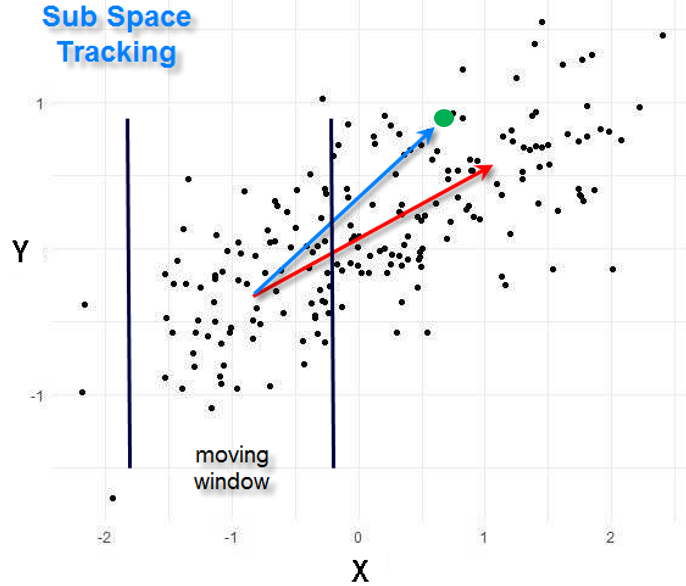

If we look at the scatter plot data using SST, instead of a cluster we derive a vector shown here in red from the principal components of the accelerometer data.
When a new data point, shown here as a green dot is received, a new PC vector is created.  Shown here as the blue vector.
The angle between the red and blue vectors is the amount of deviation from the baseline.
This information will be passed to our mobile application where thresholds are checked and will identify if the new observation is an anomaly.
Our vectors are calculated dynamically from a moving window of 300 samples.
As with k-means, this is a simplified view of what is actually happening.
Vectors are by nature 3 dimensional and eigenvectors must be used to tune the model.
Here are values used to train this model.  Here we can see our window length, input fields and eigen settings.

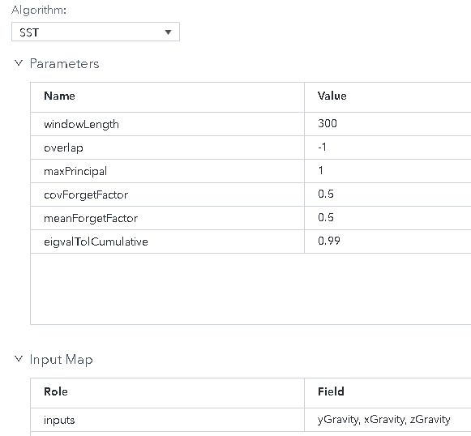

The output map references principal components, angles and our 3 vectors.

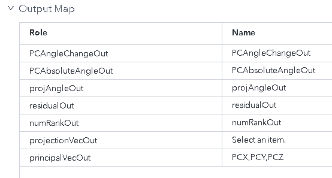

### Join

Now that all the data science is done we need to join all the information into one event and then send it back to the MQTT broker.
The broker will then deliver it back to our mobile device to be displayed.
From the following picture you can see our newly combined data includes fields calculated by SST, k-means and summary statistics.

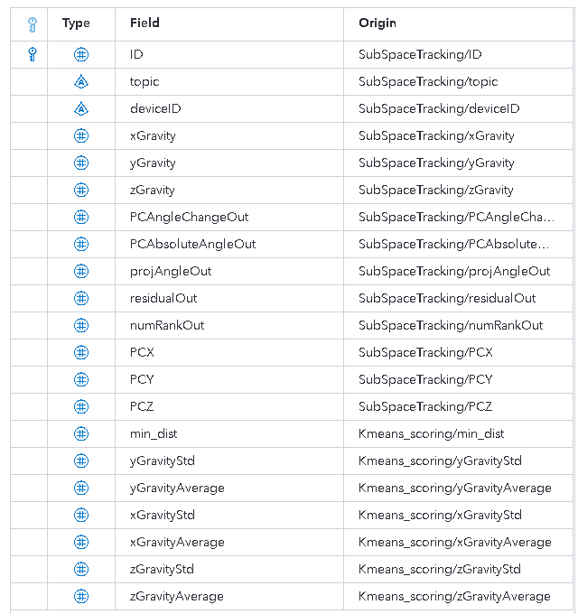

On bottom right of the join window you will see a connector icon.
This indicates that this window contains a connector.  In this case an MQTT connector.
This connector will JSON encode the data from our output schema and send it to the MQTT broker. 

## Anomaly Detection Example

Now let's take a look at the use case where the mobile device is a sensor and has been placed on a stationary piece of equipment on a factory floor.
For demo purposes our anomaly detection time frame will be 30 seconds.
At this point we have our ESP project running and our mobile device is connected to an MQTT broker and is receiving accelerometer data.
The ESP project analyzes and improves the data and then sends results back to the MQTT broker topic called "Outcomes".
The mobile application includes thresholds which determine warning and error levels.
We start by selecting anomaly detection from the navigation panel and setting the phone down for 30 seconds to establish a baseline for both k-means and SST.
Once this baseline is set the anomaly detection will report green.
Later we start moving the phone.
The anomaly detection panel will turn yellow and then red based on how much the phone is moved.

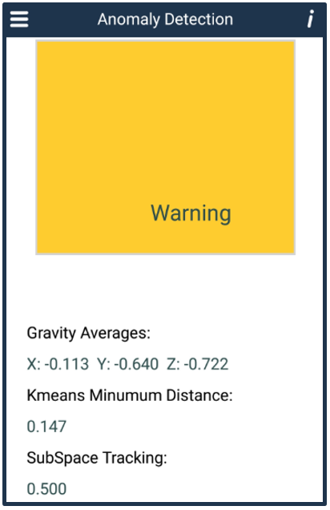

## Summary 

This repository has shown some key features found in Event Stream Processing.
Using ESP you can easily collect data from remote sensors using industry standard protocols.
After parsing, we then retained events in memory so that advanced analytical methods can be used to create an anomaly detector.
Dynamic model training allows models to be continuously trained based on real time data and is shown here using both the calculate and train windows.
Data can be a easy combined using the join window and then published to an outbound topic.
The mobile platform provides a level of personal interaction with the data that cannot be easily replicated using canned data sources.
It helped me better understand how SST and k-means work in an interactive environment and I hope it will help you as well.

## Contributing

This repo is not open for external contributions.

## License

This project is licensed under the [Apache 2.0 License](LICENSE).

## Additional Resources

* SAS Event Stream Processing 6.2 : [Documentation](https://go.documentation.sas.com/?cdcId=espcdc&cdcVersion=6.2&docsetId=espov&docsetTarget=home.htm&locale=en)

